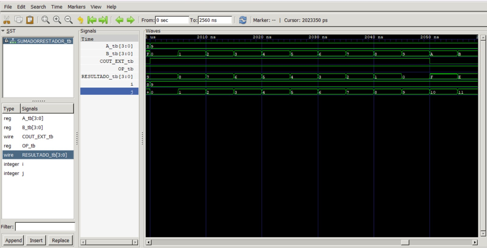
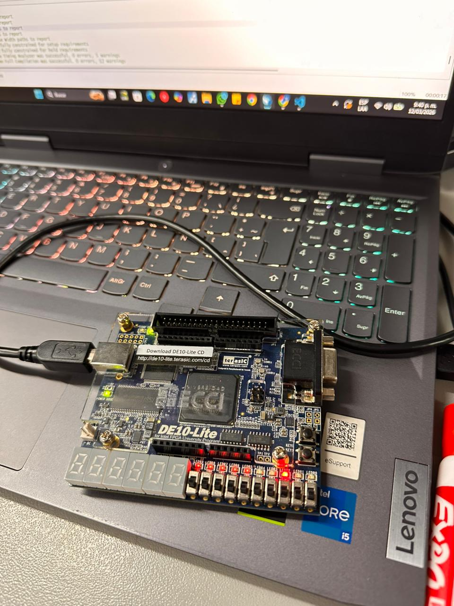
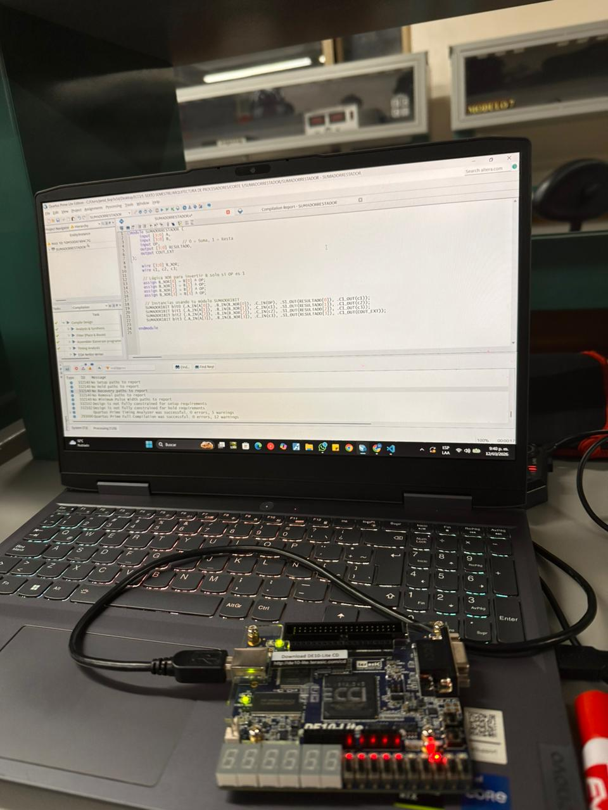
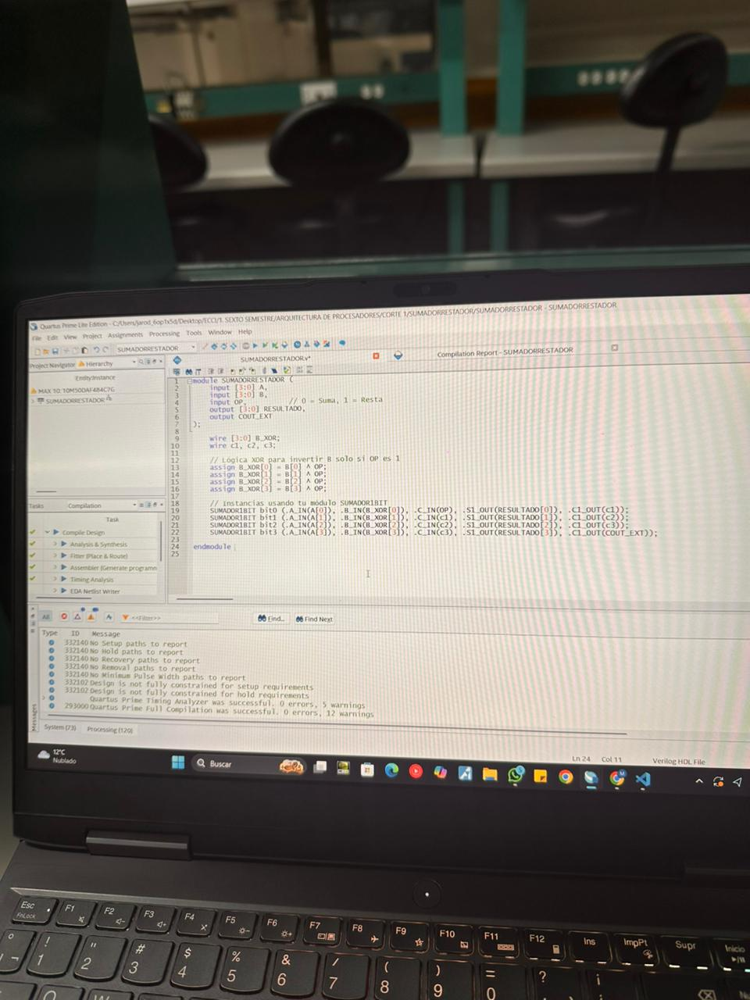
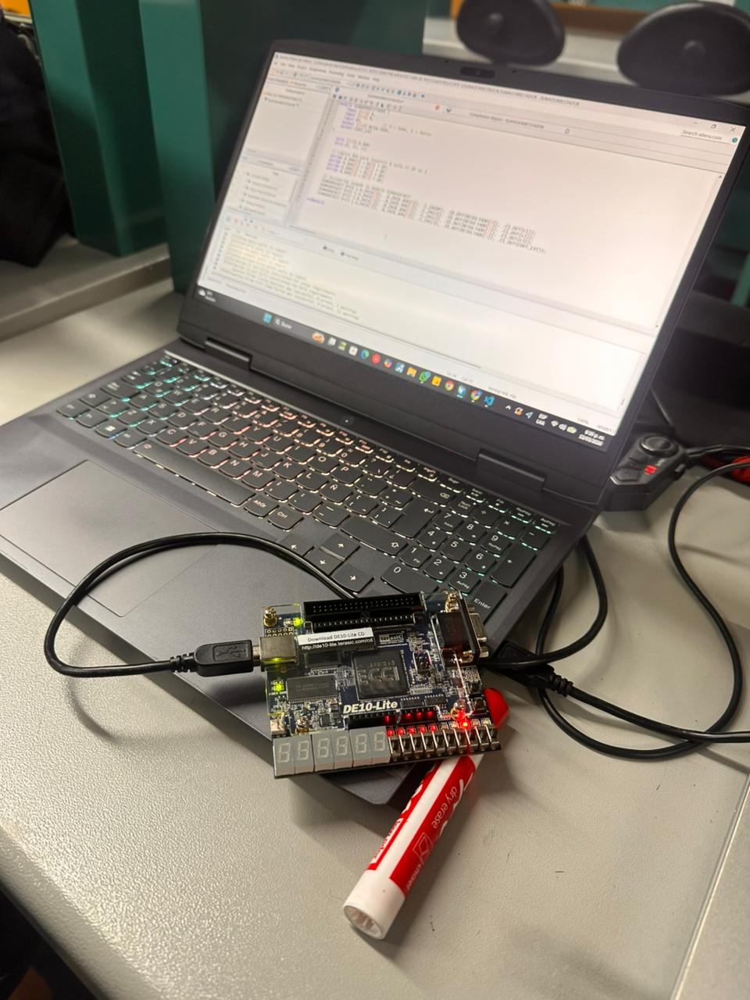

# Lab02 - Diseño e implementación de un sumador/restador de 4 bits mediante el uso de tecnología FPGA 👨‍💻

## Integrantes
* Steven Balbuena Torres 127007 
* Michael Jarod Bayona Leon 135216 
* Sebastian Alejandro Lozano Guarnizo 126608

## I. INTRODUCCIÓN
Este informe detalla el diseño e implementación de un circuito aritmético capaz de realizar sumas y restas de números binarios de 4 bits. El sistema utiliza la representación de complemento a 2 para simplificar la arquitectura, permitiendo que un mismo bloque sumador ejecute ambas operaciones mediante lógica combinacional adicional.[1] 

## II. Resumen 
Este laboratorio describe el diseño, simulación e implementación física de un circuito aritmético sumador/restador de 4 bits. El objetivo principal fue la reutilización de una arquitectura de suma convencional para realizar operaciones de sustracción mediante la técnica de complemento a 2, optimizando así el uso de recursos de hardware. La lógica del sistema emplea compuertas XOR como inversores controlados por una señal de selección ($Sel$), la cual permite conmutar entre la suma ($A+B$) y la resta ($A-B$) al transformar el sustraendo en su forma negativa ($A + (\sim B + 1)$).El diseño fue descrito en lenguaje Verilog (HDL) y validado inicialmente mediante simulaciones lógicas, donde se verificó la correcta propagación de acarreos y la precisión de los resultados binarios. Posteriormente, el sistema se implementó en una tarjeta de desarrollo FPGA DE10-Lite utilizando el software Quartus Prime, permitiendo la interacción física a través de periféricos de entrada y salida. Los resultados obtenidos confirman que la integración de la señal de control tanto en las compuertas XOR como en el acarreo inicial ($C_{in}$) permite una transición eficiente entre operaciones, cumpliendo con los estándares de diseño de sistemas digitales modernos.

## III. FUNDAMENTO TEÓRICO
A. Complemento a 2La resta $A - B$ se transforma en una suma mediante la identidad $A + (\sim B + 1)$. Este proceso implica dos fases:
1. Inversión (Complemento a 1): Invertir todos los bits de $B$.
2. Suma de la unidad: Añadir 1 al resultado anterior para obtener la representación negativa.

B. Implementación con Compuertas XORLas compuertas XOR actúan como inversores controlados por una señal Sel:
* Si Sel = 0: El circuito realiza la suma $A + B$.
* Si Sel = 1: Las XOR invierten $B$ y se introduce un 1 en el acarreo inicial ($C_{in}$), ejecutando la resta $A - B$. 

## IV. DISEÑO Y METODOLOGÍAA. 
A. Descripción de Hardware (HDL)Se desarrolló el diseño en Verilog (visible en las capturas de Quartus Prime). El módulo principal SUMADORRESTADOR instancia cuatro bloques de sumadores de 1 bit, conectando los bits de acarreo de forma serial.

B. SimulaciónSe realizaron pruebas funcionales para validar el comportamiento lógico antes de la carga en hardware. En las capturas de pantalla de la simulación (ModelSim/GTKWave), se observa:

- Las señales de entrada A_tb y B_tb.

- La señal de control OP_tb (equivalente a Sel).

- El resultado RESULTADO_tb y el acarreo de salida COUT_EXT_tb.

## V. DESARROLLO DEL DISEÑO (IMPLEMENTACIÓN EN HDL)
El diseño se centra en la integración de un módulo sumador/restador de 4 bits utilizando una arquitectura de acarreo en serie (Ripple Carry Adder). El desarrollo se desglosa en los siguientes niveles:

### A. Arquitectura del Sistema
El circuito utiliza cuatro bloques de sumadores de 1 bit interconectados. La flexibilidad para realizar ambas operaciones se logra mediante la implementación de una lógica de control basada en compuertas XOR.
* Lógica de Inversión: Cada bit del operando $B$ se conecta a una entrada de una compuerta XOR, mientras que la otra entrada recibe la señal de control Sel (u OP).
* Control de Operación: Cuando Sel = 1, las compuertas XOR funcionan como inversores, entregando el complemento a 1 de $B$. Simultáneamente, Sel alimenta el acarreo de entrada ($C_{in}$) del primer sumador, sumando el "1" necesario para completar la conversión a complemento a 2.
* Suma Directa: Cuando Sel = 0, las compuertas XOR dejan pasar el valor original de $B$ y el $C_{in}$ inicial es 0, ejecutando una suma convencional $A + B$.
### B. Descripción en Verilog (HDL)
Basado en las capturas del entorno Quartus Prime, el diseño se estructuró de forma modular:

1. Módulo Sumador de 1 Bit: Se define la lógica fundamental para obtener la suma ($S$) y el acarreo de salida ($C_{out}$) a partir de tres entradas ($A, B, C_{in}$).
2. Módulo Top-Level (SUMADORRESTADOR): * Declara las entradas A[3:0], B[3:0] y la señal de control OP.

* Implementa las asignaciones para la lógica XOR: assign B_XOR[i] = B[i] ^ OP para cada bit.

* Instancia los cuatro sumadores, propagando el acarreo de forma interna (c1, c2, c3) hasta el acarreo final de salida COUT_EXT.

### C. Flujo de Implementación
El diseño siguió un flujo de trabajo estándar para sistemas digitales:

* Codificación: Escritura del código RTL en Verilog respetando la jerarquía modular.
* Análisis y Síntesis: Uso de Quartus Prime para transformar el código en una netlist de compuertas lógicas compatible con la arquitectura de la FPGA MAX 10.
* Asignación de Pines: Vinculación de las señales A, B y OP a los interruptores físicos (switches) y las salidas de resultado a los LEDs y periféricos de la tarjeta DE10-Lite.

## VI. Resultados y Análisis
El proceso de validación del sumador/restador de 4 bits se dividió en dos etapas críticas: la verificación lógica mediante simulación funcional y la implementación física en hardware real.

### A. Análisis de Simulación Funcional
A través de las herramientas de simulación, se comprobó que el diseño responde correctamente a la lógica de control establecida por la señal OP. En las formas de onda obtenidas, se observa que cuando la señal de operación es baja (OP = 0), el sistema transfiere los bits de la entrada $B$ íntegramente a los sumadores, ejecutando la operación aritmética de adición $A + B$. Por el contrario, al activar la señal de control (OP = 1), las compuertas XOR realizan la inversión bit a bit del operando $B$, mientras que simultáneamente se introduce un nivel lógico alto en el acarreo inicial del primer bloque sumador ($C_{in}$). Este comportamiento asegura la obtención del complemento a 2 de forma automática, permitiendo que la resta se ejecute como una suma interna: $A + (\sim B + 1)$.

### B. Implementación en Hardware (FPGA)
La descripción de hardware en Verilog fue sintetizada exitosamente utilizando el IDE Quartus Prime para la tarjeta DE10-Lite. Durante las pruebas físicas, se utilizó el banco de interruptores para asignar valores binarios a las entradas $A$ y $B$, y los LEDs de la tarjeta para visualizar el resultado final y el acarreo de salida ($C_o$). Se analizó que el bit de acarreo final actúa como un indicador de signo en las operaciones de resta: un acarreo de 1 indica que el resultado es positivo (como en la operación $7 - 5 = 2$, donde el acarreo se desprende del MSB), mientras que un acarreo de 0 señala un resultado negativo expresado en formato de complemento a 2.

### C. Discusión Técnica
La eficiencia del diseño radica en la reutilización de los bloques sumadores de 1 bit, lo que minimiza el área de silicio ocupada en la FPGA. Se observó que la propagación del acarreo ocurre de manera serial entre los bloques, lo que introduce un retardo combinacional mínimo, pero suficiente para ser despreciable en las frecuencias de operación manejadas en este laboratorio. La implementación confirmó que el uso de compuertas XOR como inversores controlados es una solución robusta para integrar dos operaciones aritméticas fundamentales en una sola ruta de datos.

## VII. ANEXOS EVIDENCIAS EN FPGA. 

## VIII. CONCLUSIONES
* Se logró reutilizar un sumador de 4 bits para realizar restas de forma eficiente mediante lógica XOR y control de acarreo inicial.

* La simulación previa garantizó que la lógica de inversión y suma de la unidad ($+1$) funcionara correctamente antes de la programación de la FPGA.

* El uso de la tarjeta DE10-Lite permitió validar el diseño en un entorno físico real, cumpliendo con los objetivos de aprendizaje planteados.

## IX.  AGRADECIMIENTOS
Queremos agradecer primero que nada al profesor Jhon por explicarnos los temas de sistemas digitales y guiarnos en este laboratorio. Su explicación sobre cómo funciona realmente el complemento a 2 y cómo aplicarlo con las compuertas XOR fue clave para que no nos perdiéramos al armar el circuito.

También le agradecemos a la universidad por prestarnos las tarjetas DE10-Lite y las computadoras con el Quartus, ya que sin ese hardware no habríamos podido pasar de la teoría a ver el sumador funcionando en la vida real. Por último, gracias a los compañeros que nos dieron una mano cuando el código Verilog no quería compilar o cuando teníamos errores en la asignación de los pines.

## X REFERENCIAS
- [1] Universidad ECCI, "Guía de Laboratorio 02" Bogotá D.C., Colombia, 2026.
- [2] Terasic Inc., "DE10-Lite User Manual," [En línea]. Disponible en: https://www.terasic.com.tw/. Accedido: 11 de marzo de 2026.
- [3] IEEE Computer Society, "IEEE Standard for Verilog Hardware 

